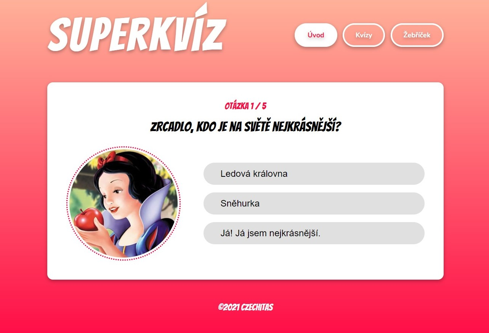

# Projekt Superkvíz

<span style="color: red;">Aplikaci jsem naprogramovala v **Reactu** s použitím **TypeScriptu**.</span>  
<span style="color: red;">Pro načítání dat jsem využila cloudovou databázi **Supabase**.</span>



<!-- 
## Původní zadání
Naprogramuj Superkvíz! Ve složce `html-vzor`, máš tam připravený vzhled aplikace v podobě hotového HTML, CSS a připravených obrázků.


## API

Data do aplikace vezmeš na následujících adresách:

### Přehled všech kvízů
```
https://raw.githubusercontent.com/Czechitas-React-podklady/superkviz-api/main/quizes.json
```
[Ukázka dat](https://github.com/Czechitas-React-podklady/superkviz-api/blob/main/quizes.json)

---

### Detail jednoho kvízu
Místo čísla `1` na konci dosadíš vždy ID kvízu, jehož data si přeješ.
```
https://raw.githubusercontent.com/Czechitas-React-podklady/superkviz-api/main/quiz/1.json
```
[Ukázka dat](https://github.com/Czechitas-React-podklady/superkviz-api/blob/main/quiz/1.json)

---

### Žebříček nejlepších
```
https://raw.githubusercontent.com/Czechitas-React-podklady/superkviz-api/main/topscore.json
```
[Ukázka dat](https://github.com/Czechitas-React-podklady/superkviz-api/blob/main/topscore.json)
-->